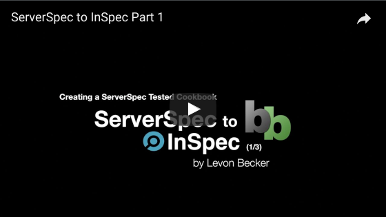

# Example ServerSpec to InSpec Migration

## Purpose
The purpose of this project is to demonstrate the stages via branches of doing a Chef Cookbook ServerSpec integration tests conversion to InSpec integration tests. 

## Part 1 - Create a ServerSpec Tested Cookbook
The first step is to create and example Chef cookbook that uses ServerSpec integration testing. We'll be setting it up with kitchen-docker Test Kitchen driver.

#### Links
* [Written Instructions](https://www.bonusbits.com/wiki/HowTo:Migrate_ServerSpec_to_InSpec_-_Part_1)
* [Walkthrough Video](https://youtu.be/fn_GV9Ejnqc) 

## Other Links
* [YouTube Playlist](https://www.youtube.com/playlist?list=PLy2eDDzDOIEpf6obkRNB_Eikx32b68f8I)
* [Written Instructions Root Article](https://www.bonusbits.com/wiki/HowTo:Migrate_ServerSpec_Integration_Tests_to_InSpec_for_Chef_Cookbook)